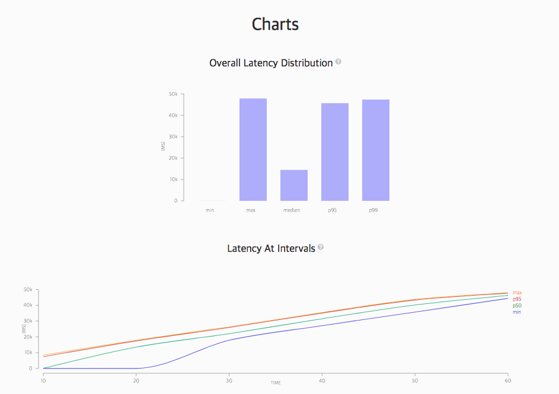
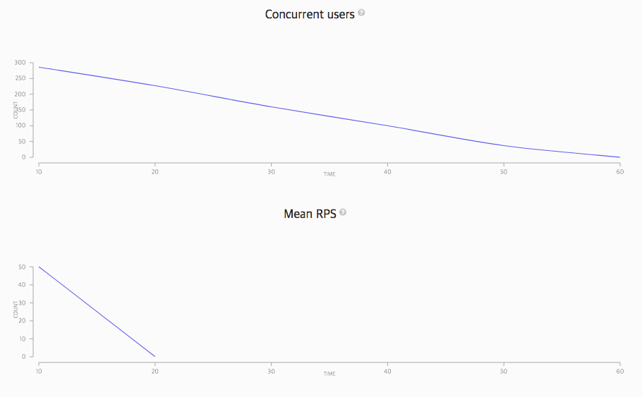
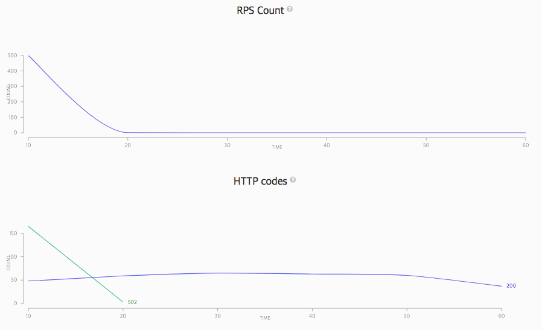

# Stress Tester

You can simply test the server stress with a single line of code and view the report.

## Prerequisite: Node.js

Install [Node.js® and npm](https://nodejs.org/en/download/current/) if they are not already on your machine.

## Installation
```bash
$ npm install
``` 
 
## How to use

1. edit config.json (docs: https://artillery.io/docs)

2. run shell script
```bash
$ sh run.sh 
```

## result example

```bash
Summary report @ 14:59:52(+0900) 2018-06-16
  Scenarios launched:  500
  Scenarios completed: 500
  Requests completed:  500
  RPS sent: 8.83
  Request latency:
    min: 38.2
    max: 47874.1
    median: 14476.6
    p95: 45667.5
    p99: 47354.7
  Scenario counts:
    post get api test: 500 (100%)
  Codes:
    200: 332
    502: 168

Log file: output.json
Report generated: output.json.html
```

</img>
</img>
</img>
  
## reference
 
https://blog.outsider.ne.kr/1238